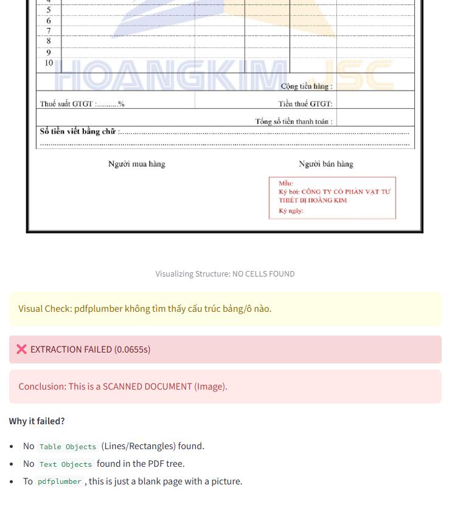
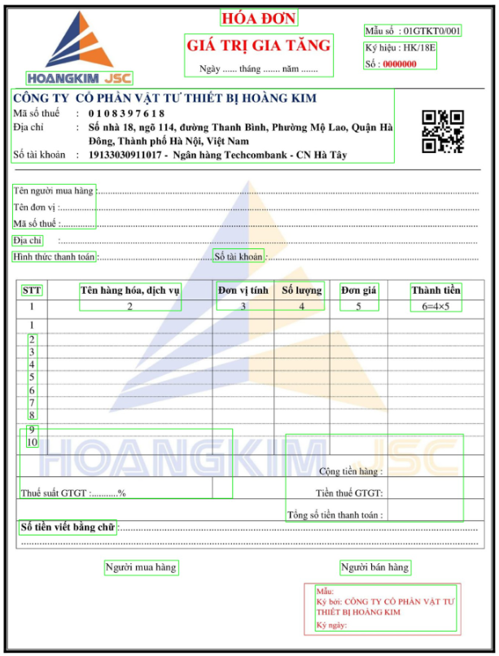
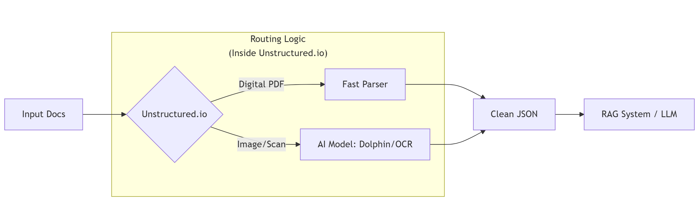

# Trích xuất dữ liệu từ tài liệu
## Các phương pháp từ truyền thống đến hiện đại

**Chủ đề:** Document Parsing
**Nhóm trình bày:** 
22120252 - Giang Đức Nhật
22120427 - Nguyễn Mạnh Văn
22120450 - Bùi Đình Gia Vỹ

---

# 1. Bài toán thực tế

Hãy tưởng tượng chúng ta xây dựng ứng dụng theo dõi chi tiêu cho một công ty. 
Nhân viên tải lên hàng trăm hóa đơn mỗi ngày.

**Mục tiêu:** Tự động trích xuất **Ngày tháng**, **Tổng tiền**, và **Danh sách mặt hàng**.

Chúng ta thường gặp 2 loại file chính:

1.  **Digital-Native PDFs:** Xuất trực tiếp từ Word/Excel. Thẳng hàng, sạch đẹp.
2.  **Scanned/Image PDFs:** Ảnh chụp bằng điện thoại hoặc máy scan cũ. Mờ, nghiêng, nhiễu.

> *Vậy với mối loại file này chúng ta có những cách nào để giải quyết?*

---

# DEMO TIME (PHẦN 1)
### Kịch bản A: Digital Invoice

**Mục tiêu:** Parse một file digital invoice
**Công cụ:** `pdfplumber`
**Dự đoán:** Sẽ xử lý mượt mà, lấy được bảng đẹp.

*(Chuyển sang màn hình Streamlit - Mode Traditional)*

---

# 2. Tại sao nó làm tốt? (Sức mạnh của `pdfplumber`)

Chúng ta vừa thấy `pdfplumber` xử lý file Digital cực nhanh và chính xác. Đây là lý do nó là "Vua" của Digital PDFs:

### Ưu điểm vượt trội
1.  **Table Extraction:** Khả năng xử lý bằng rất tốt (xử lý merged cells, lines).
2.  **Độ chính xác 100%:** Đọc trực tiếp mã nguồn PDF, không bao giờ "nhìn nhầm" số.
3.  **Tốc độ:** Xử lý ngay lập tức (Real-time).

---

# DEMO TIME (PHẦN 2)
### Kịch bản B: Scanned Invoice

Mục tiêu: Thử thách pdfplumber với file ảnh chụp (Scan). Dự đoán: ???

(Chuyển sang màn hình Streamlit - Vẫn Mode Traditional)

---

# 3. Tại sao nó thất bại? (Nguyên lý)

Công cụ chúng ta vừa dùng (`pdfplumber`) hoạt động dựa trên **Tọa độ (Coordinate-based)**.

### Cơ chế hoạt động:
Nó KHÔNG "nhìn" thấy tài liệu như mắt người. Nó đọc **PDF Object Tree**.
- Nó tìm các lệnh như: `Vẽ chữ "Total" tại x=100, y=500`.

### Hạn chế chết người:
- Với file Scan (Ảnh), **KHÔNG HỀ CÓ lệnh vẽ chữ nào**.
- Đối với `pdfplumber`, file scan chỉ là một trang giấy trắng chứa một bức ảnh to.
- Ngay cả với file Digital, nếu bố cục bị lệch một chút, code tọa độ cứng sẽ sai ngay.

---

# Cơ chế bên dưới: PDF Object Tree

Để hiểu tại sao `pdfplumber` thất bại, ta phải nhìn vào **cấu trúc dữ liệu** của PDF.
PDF không phải là dạng plain text, nó là một cây đối tượng (Object Tree):

  

  **File Digital (Gốc)**
  Cấu trúc cây có TextObject và PathObject:
  - `/Page`
    - `/Resources`
    - `/Contents`
      - **`TextObject`** (Chứa tọa độ & chữ)
      - `PathObject` (Đường kẻ bảng)

  `pdfplumber` duyệt cây này để lấy dữ liệu.

  

  

  **File Scan (Ảnh)**
  Cấu trúc cây không có các TextObject:
  - `/Page`
    - `/Resources`
    - `/Contents`
      - **`XObject (Image)`**
      - *(Không có TextObject nào!)*

  `pdfplumber` tìm `TextObject` $\rightarrow$ Không thấy $\rightarrow$ **Rỗng**.

  

---

# 4. Giải pháp: Computer Vision (AI)

Khi cấu trúc cây (Object Tree) không chứa dữ liệu văn bản, ta cần một mô hình bỏ qua cấu trúc cây và **"nhìn"** vào điểm ảnh (Pixels) như con người.

### Pipeline hiện đại (Ví dụ: LayoutLM, Dolphin, Azure DI):

1.  **Vision Encoder:** Chuyển ảnh trang giấy thành các điểm ảnh (pixels).
2.  **OCR:** Phát hiện hình dáng các con chữ (kể cả khi bị nghiêng hay mờ).
3.  **Layout Analysis:** Hiểu được "Khối này là Bảng" và "Khối kia là Tiêu đề".

> *Nó không quan tâm code bên dưới là gì. Nó chỉ quan tâm tài liệu **trông** như thế nào.*

---

# DEMO TIME (PHẦN 2)
### Cách tiếp cận "AI / Vision"

**Kịch bản:** Chúng ta sẽ thử đọc LẠI file **Hóa đơn Scan** (mà lúc nãy bị lỗi) bằng công nghệ Computer Vision.

*(Chuyển sang màn hình Streamlit để xem AI vẽ khung hình)*

---

# Kết quả Demo (Recap)

Nếu demo chạy đúng, các bạn sẽ thấy sự khác biệt rõ rệt của 2 phương pháp này:

  

  
  
<strong>Traditional: Fail</strong> (Không tìm thấy Text Object)

  

  

  
  
<strong>AI Vision: Success</strong> (Nhìn thấy chữ từ Pixels)

  

---

# Cơ chế bên dưới: AI nhìn thấy gì?

Thay vì tìm tọa độ (x, y) trong metadata, AI xử lý **Mảng các điểm ảnh (Pixel Matrix)**.

**Quy trình xử lý mà Demo vừa chạy:**

1.  **Preprocessing:** Chuyển PDF thành Ảnh (Image) $\rightarrow$ Khử nhiễu.
2.  **Text Detection:** Khoanh vùng "Ở đâu có chữ?" (Chính là các **ô màu xanh** trong demo).
3.  **Text Recognition:** Cắt ô xanh đó ra và hỏi "Đây là chữ gì?".
4.  **Layout Analysis:** Ghép các chữ lại thành dòng và bảng.

> **Sức mạnh:** AI "đoán" chữ dựa trên hình dáng $\rightarrow$ Đọc được file scan, chữ viết tay.

---

# 5. So sánh & Chiến lược

Khi nào nên dùng cái nào?

| Tính năng | Truyền thống (`pdfplumber`) | AI Hiện đại (OCR/Vision) |
| :--- | :--- | :--- |
| **Phương pháp** | Đọc Metadata của PDF | Đọc Pixels |
| **Xử lý Bảng (Table)** | **Xuất sắc** (Giữ đúng cấu trúc) | Khá (Cần xử lý hậu kỳ nhiều) |
| **Tốc độ** | **Siêu nhanh** (ms) | **Chậm hơn** (giây) |
| **Độ tin cậy** | **~100%** | ~98% (Có thể "hallucinate"/nhìn nhầm) |
| **Chi phí** | Miễn phí / Tốn ít CPU | Cao (Cần GPU / API) |
| **File Scan** | Bó tay | **Xuất sắc** |
| **Độ chính xác** | 100% (nếu là file gốc) | ~95-99% (Xác suất) |

**Kết luận:** Dùng phương pháp **Truyền thống** cho file digital số lượng lớn. Dùng **AI** làm phương án dự phòng (fallback) cho file xấu/scan.

---

# 6. Beyond the Basics: Enterprise Tools

> Trong thực tế Production, chúng ta thay thế script thủ công bằng các công cụ chuyên dụng.

  

  ### Microsoft Dolphin / LayoutLM  
  **"The Brain" — Bộ não**

  - **Loại:** Multimodal AI
  - **Khả năng:** Không chỉ OCR (đọc chữ) mà còn hiểu *ngữ nghĩa & bố cục*
  - **Ví dụ:** Tự biết cụm chữ in đậm ở góc trên là **"Tên Công Ty"** chứ không chỉ là text rời rạc.

  

  

  ### Unstructured.io  
  **"The Manager" — Bộ quản lý luồng dữ liệu**

  - **Loại:** ETL / Pre-processing Engine  
  - **Khả năng:** Tự động **routing thông minh**  
    - File đẹp (Digital) → Fast Parser (chi phí thấp)  
    - Scan mờ → Gọi AI Model (chi phí cao)

  

**Kết luận:**  
**Dolphin giúp xử lý document — Unstructured giúp tự động hóa việc chọn công cụ.**

---

# 7. The Ultimate Goal: Automated Pipeline

Kết hợp tất cả lại, đây là kiến trúc chuẩn cho một hệ thống **RAG** hoặc **Data Entry** tự động:

  

**Thông điệp:** "Unstructured.io dùng để quản lý luồng xử lý file, còn pdfplumber hay Dolphin là các "engine" xử lý ở mỗi luồng."

---

# Cảm ơn mọi người!

**Công cụ sử dụng:**
- **Frontend:** Streamlit
- **Thư viện:** pdfplumber
- **Concept:** OCR & Vision Transformers

